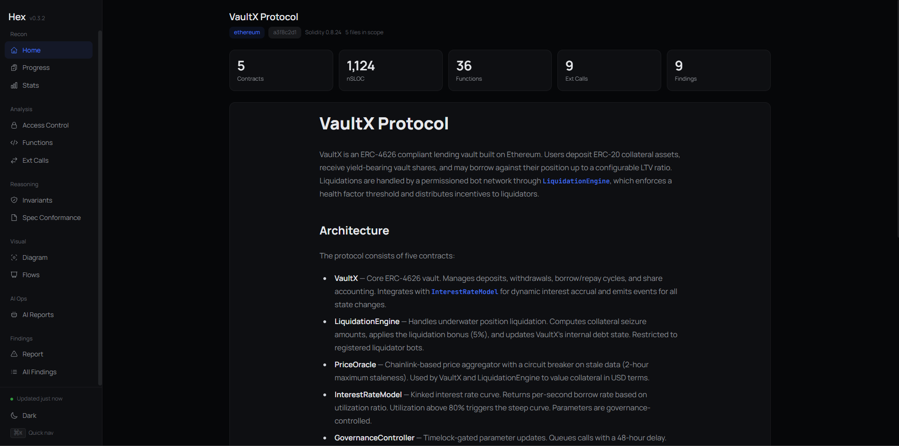

# Hex

A toolkit for Solidity smart contract auditors. Hex combines Claude Code skills, deterministic analysis tools, and a local dashboard to take you from "I just received the code" to "here are my validated findings" — faster and with better coverage.

Hex does not replace your expertise. It automates the mechanical parts of auditing (parsing, stat collection, diagramming, PoC scaffolding, finding write-ups, LaTeX report generation) so you can spend your time on what actually matters: reading code and thinking about what can break.



## How It Works

You drive Hex through Claude Code. Type `/init-audit` and Claude runs the whole pre-review pipeline. Three components do the work behind the scenes off a shared project directory:

**Claude Code skills** are the front door. They handle anything that requires reasoning — generating the protocol overview and diagrams, checking spec conformance, writing PoCs, drafting findings, ingesting external AI reports, syncing with GitHub, producing the final LaTeX report. You invoke them as native slash commands (e.g., `/init-audit`, `/write-finding`, `/validate-issue`). Skills are markdown files that ship with the `hex` package and get copied into your project's `.claude/skills/` directory. They're editable per-project if you need to customise them.

**The `hex` CLI** is the deterministic engine the skills call into. It wraps battle-tested tools like Slither, solc, and Forge rather than reinventing static analysis, and it emits structured JSON with confidence metadata so you always know how much to trust a given data point. You can call it directly when you want to, but you usually won't — `/init-audit` does it for you.

**The dashboard** is a local Next.js app that visualises everything the tools and skills produce. It reads directly from your project directory and auto-refreshes when files change. The Issues board writes back to `tracking.json`/`findings.json` when you drag a card between columns or edit it in the modal.

All three components read from and write to the same project directory. There is no server, no database, no accounts. Everything stays local.

## Prerequisites

Before using Hex, make sure you have the following installed:

- **Claude Code** — Anthropic's CLI tool for agentic coding
- **Node.js** (v18+) and npm
- **Foundry** (`forge`, `cast`) — or Hardhat if that's what the project uses
- **Slither** — `pip install slither-analyzer`
- **solc** — the Solidity compiler (managed via `solc-select` or Foundry)
- (Optional, for `/ingest-aa-report`) **AuditAgent CLI** — `pip install git+https://github.com/NethermindEth/auditagent-cli.git`

Run `hex doctor` once you've installed Hex (next section) to confirm everything is in place — it prints a labelled preflight table with install hints for anything missing.

## Quick Start

### 1. Clone the client project and install Hex

```bash
# Clone or receive the client project as usual
git clone https://github.com/client/protocol.git
cd protocol

# Install Hex globally
npm install -g hex-audit
```

### 2. Drop the skills into the project and open Claude Code

```bash
hex claude   # copies the audit skills into .claude/skills/
claude       # open Claude Code in this directory
```

`hex claude` is the only CLI call you need before Claude Code can take over — it copies the skill files so `/init-audit` and friends show up as native slash commands.

### 3. Let Claude initialise the audit

Inside Claude Code (switch to **Opus** first):

```
/init-audit
```

Claude will ask you for scope, commit, chain, and docs URL, then run the entire pre-manual-review pipeline in one skill: dependency-safety audit → `hex analyze` → protocol overview → system diagram → flow charts → spec conformance → materialize conformance deviations onto the issue board as Potential cards.

By the time `/init-audit` finishes, every analysis page on the dashboard has data and the `/issues` board shows the conformance-derived items waiting for manual triage.

### 4. Dashboard opens automatically

`/init-audit` launches `hex dashboard` in the background as its last step, so `http://localhost:3000` opens in your browser when the pre-review pipeline finishes. Leave it open as you work — every page fills in automatically as Claude generates more analysis. If you ever need to start it manually, just run `hex dashboard` in a second terminal (`--port 8080` for a custom port, `--no-open` to skip the auto-open).

---

## The Audit Workflow

Hex follows a four-phase workflow. You move through the phases sequentially, but you can always go back and re-run earlier steps. Every command in this section is typed inside Claude Code.

### Phase 1 — Pre-review (`/init-audit`)

One skill does it all:

```
/init-audit
```

Inside `/init-audit`:

- **Dependency safety scan.** Inspects `package.json` install hooks, Foundry `lib/` submodules, `foundry.toml` (FFI, fs_permissions, remappings), `.env*` for plaintext secrets, `.vscode/extensions.json` for untrusted publishers. Stops before compilation if anything looks risky.
- **`hex analyze`** runs stats, deps, access, state, calls, patterns, constraints in parallel, then surface last.
- **`overview.md`** — a 2-3 paragraph protocol overview with a key contracts table, external dependencies, and architecture notes. Same scope as the simpler standalone skill it replaced — pure description, no findings or speculation.
- **System diagram** — `.hex/diagrams/diagram.mmd` (split into multiple files if >15 nodes). Semantic symbols (🏦 Vault, 💰 Token, 🔮 Oracle, 🔒 Governance, 📦 Storage), trust-zone colour coding, typed edge labels (delegatecall, external call, access-controlled), visual legend.
- **Flow charts** — `.hex/diagrams/flow-*.mmd` per archetype (Vault → deposit/withdraw/strategy; Lending → borrow/repay/liquidate; Bridge → send/receive; Governance → propose/vote/execute; AMM → swap/add/remove; Staking → stake/claim/compound). Distinct shapes by semantic role. Every decision diamond shows both success and revert paths.
- **Spec conformance** — cross-references docs, NatSpec, interfaces, ERC/EIPs. Canonical specs are fetched from `eips.ethereum.org`. Output: `spec-conformance.json` with `CONFORMS / DEVIATES / PARTIAL / UNVERIFIABLE / UNDOCUMENTED` + spec-section URLs.
- **Materialize conformance items.** Every DEVIATES/PARTIAL spec item is materialized as a Potential card on the issue board (source `conformance`).

All pages support filtering by confidence level so you can focus on entries that need manual verification.

### Phase 2 — Manual review

Read the code in your editor. Drop `@audit-issue` comments above anything suspicious:

```solidity
// @audit-issue Possible reentrancy — external call before state update.
IERC20(token).transfer(recipient, amount);
```

When you have something concrete, file it as a Potential issue:

```
/write-finding for the rounding error in src/Vault.sol
```

`/write-finding` writes the finding to `findings.json` with the next sequential `F<NNN>` ID. The corresponding tracking entry has `status: "pending_validation"` and `source: "manual"`, so the card lands in the **Potential** column on the dashboard board.

Phase 2 is where Hex gets out of your way. You think; the toolkit just gives you a place to record what you find.

### Phase 3 — Validate, ingest, sync

#### Validate any Potential card (`/validate-issue`)

`/validate-issue` is source-agnostic. It validates:

- Manual `pending_validation` entries from `/write-finding`.
- Conformance DEVIATES/PARTIAL entries materialized by `/init-audit`.
- Auditagent `unverified` entries materialized by `/ingest-aa-report`.
- GitHub teammate entries materialized by `/sync-issues`.

```
/validate-issue F003
/validate-issue SC-007
/validate-issue AA-N002
/validate-issue for the rounding issue in Vault.sol
```

Claude reads the relevant source-of-truth (findings.json | ai-results/auditagent/findings.json | spec-conformance.json | external/github/findings.json), traces the attack path in the code, and writes a validation memo to `.hex/validations/<id>_memo.md`. Then it asks per issue:

> The issue appears valid. PoC or memo-only?

If PoC: invokes `/generate-poc` to produce a runnable test and iterates until it passes. If memo-only: skips PoC, just records the validation reasoning.

Valid → tracking entry promotes to `verified` (the card moves to Verified). Invalid → tracking entry becomes `rejected` (the card moves to Invalid). Severity adjustment is offered after promotion.

#### Ingest a Nethermind AuditAgent scan (`/ingest-aa-report`)

Hex's only AI integration is **Nethermind AuditAgent**, and it expects the scan to already exist. The skill **does not start scans** — you start the scan separately (the Nethermind portal or `aa scan --quality auditor <scope-files>` from the command line), then paste the scan ID:

```
/ingest-aa-report <scan-id>
```

The skill:

1. Calls `aa scan --status <scan_id>`. If the scan is still running, it prints status and exits — come back later. (`hex ai-status --watch` in a second terminal notifies when the scan finishes.)
2. On completion, fetches the report and writes raw output to `.hex/ai-results/auditagent/raw-output.md` plus normalised findings to `findings.json` + `metadata.json` under the same folder.
3. Materializes each finding as a Potential card (source `auditagent`, status `unverified`).
4. **Runs inline dedup** against every existing tracking entry. Auditagent findings that match a manual / conformance / github entry on contract+function+root_cause+attack_vector flip to `duplicate` and surface in the Duplicate column with the match_signals visible on the card.

#### Team mode (`/sync-issues`)

When two or three auditors share an engagement, sync findings through a shared GitHub repo. Set `settings.github.repo` in `.hex/config.json` (the firm's internal repo, e.g. `nethermind/audit-vaultx`) and authenticate the `gh` CLI once:

```bash
gh auth login
```

Hex itself never stores GitHub credentials — `/sync-issues` drives the `gh` CLI directly. Then:

```
/sync-issues
```

One invocation does both directions:

- **Pull** every issue with the configured labels. Issues with a hidden footer `<!-- hex-finding-id: F<NNN> -->` link back to local findings. Issues without the footer become teammate findings (`source: "github"`, status `pending_validation`).
- **Inline dedup, GitHub-canonical.** When a pulled GitHub issue matches a local potential entry, **the local entry becomes the duplicate** (`status: "duplicate"`, `duplicate_of: "github-<num>"`). Rationale: a teammate already filed it, so your in-progress local card is redundant. This is the opposite of the auditagent dedup direction, which flips the auditagent entry to duplicate.
- **Push** every local finding whose tracking status is in `settings.github.publish_status` (default `["verified"]`). Body rendered from the description, code locations, recommendation. Labels applied for severity, source, status. Existing issues are updated by their `github.issue_number`.

The dashboard's `/issues` page surfaces GitHub-sync state as a chip on each card (✓ open, ✕ closed).

Comments stay on GitHub — Hex never posts, edits, or deletes comments. Auditors discuss inside GitHub itself.

### Phase 4 — Deliverable (`/generate-overleaf`)

Once findings are validated and the engagement is winding down:

```
/generate-overleaf
```

The skill prompts once for any missing report metadata (initial/final commit, dates, audit type, documentation/test assessment) and persists them to `config.json` under `settings.report.*` so reruns don't re-prompt. Then it emits four `.txt` LaTeX files into `.hex/overleaf/`:

1. **`executive_summary.txt`** — `\section{Executive Summary}` with project synopsis, severity histogram, status histogram, summary table.
2. **`audited_files.txt`** — `\section{Audited Files}` LaTeX table of scope files (LoC, comments, ratio, blank, total).
3. **`summary_of_findings.txt`** — `\section{Summary of Issues}` table with `\hyperref` rows.
4. **`findings.txt`** — `\section{Issues}` with one `\subsection{[Sev] title}\label{issue:N}` per verified finding (description, code blocks via `minted`, recommendation, status, client update).

Upload these into the Nethermind Overleaf template's matching slots. Only `verified` findings make the report; duplicates, rejected, and pending entries are skipped.

---

## Claude Code Skills Reference

Each skill has a recommended model — switch your Claude Code model before invoking skills that recommend Opus.

| Skill               | Phase | Recommended Model | What it does                                                                                                                                     |
| ------------------- | ----- | ----------------- | ------------------------------------------------------------------------------------------------------------------------------------------------ |
| `init-audit`        | 1     | Opus              | Dependency-safety → `hex analyze` → overview → diagram → flows → spec conformance → materialize DEVIATES/PARTIAL items as Potential cards        |
| `write-finding`     | 2     | Sonnet            | Records a manual issue to `findings.json` as a Potential card (`status: pending_validation`, `source: manual`)                                   |
| `validate-issue`    | 3     | Opus              | Validates any Potential card (manual / auditagent / conformance / github); per-issue choice of PoC vs memo-only; promotes to Verified or Invalid |
| `generate-poc`      | 3     | Opus              | Generates and runs a PoC test (invoked by `/validate-issue`)                                                                                     |
| `ingest-aa-report`  | 3     | Sonnet            | Ingests a completed Nethermind AuditAgent scan by ID; materializes findings + inline dedup                                                       |
| `sync-issues`       | 3     | Sonnet            | Two-way GitHub Issues sync with GitHub-canonical inline dedup                                                                                    |
| `generate-overleaf` | 4     | Sonnet            | Writes the four LaTeX section files for the final report                                                                                         |

### Where Skills Live

Skills use Claude Code's native skill format, stored in `.claude/skills/<name>/SKILL.md`. They're copied there when you run `hex claude` or `hex init`.

```
.claude/skills/
├── init-audit/SKILL.md
├── write-finding/SKILL.md
├── validate-issue/SKILL.md
├── generate-poc/SKILL.md
├── ingest-aa-report/SKILL.md
├── sync-issues/SKILL.md
└── generate-overleaf/SKILL.md
```

**How Claude Code finds them:** Claude Code auto-discovers skills in `.claude/skills/`. They appear as native slash commands — type `/` in Claude Code to see them.

**Customising skills:** Edit any `SKILL.md` file in place.

**Upgrading Hex:**

```bash
hex update                    # install latest hex-audit + prompt to re-sync skills (one command)
hex update --check            # check for an available update without installing
hex update-skills             # re-sync skills only (use if you've already npm-installed manually)
hex update-skills --keep-custom  # skip existing skill files to preserve per-project modifications
```

`hex update` detects how Hex was installed (global or local), runs the appropriate `npm install …@latest`, then asks whether to re-copy the bundled skill files into the current project's `.claude/skills/`. Both commands remove orphaned skill directories so renamed/deleted skills clean up across versions.

---

## Dashboard Pages

The dashboard runs locally at `http://localhost:3000` and auto-refreshes when output files change. A live "Updated Ns ago" indicator in the sidebar footer tells you the watcher is connected.

| Page             | URL            | What you see                                                                                                                                                                             |
| ---------------- | -------------- | ---------------------------------------------------------------------------------------------------------------------------------------------------------------------------------------- |
| Home             | `/`            | Project info, AI overview, key stats                                                                                                                                                     |
| Progress         | `/progress`    | Weighted progress bar (70% nSLOC reviewed, 20% audit steps, 10% findings triage), contract review checklist                                                                              |
| Statistics       | `/stats`       | Per-contract metrics, test coverage, dependencies, ERCs                                                                                                                                  |
| System Diagram   | `/diagram`     | Mermaid architecture diagram with zoom/pan                                                                                                                                               |
| Flows            | `/flows`       | Mermaid flow charts with zoom/pan                                                                                                                                                        |
| Access Control   | `/access`      | Role → function matrix with "Show unprotected only" and "Show inferred / unknown modifiers" toggles                                                                                      |
| State Variables  | `/state`       | Variable inventory with reader/writer tracking and storage-collision warnings                                                                                                            |
| External Calls   | `/calls`       | Call surface with filterable Trust column                                                                                                                                                |
| Functions        | `/functions`   | Aggregated function view                                                                                                                                                                 |
| Spec Conformance | `/conformance` | Code vs spec check results, deviations first, clickable spec links                                                                                                                       |
| **Issues**       | `/issues`      | **The board.** Four columns (Potential / Verified / Invalid / Duplicate). Drag cards to change column, click to edit (severity, description, recommendation, resolution, client update). |

---

## Understanding Confidence Levels

Every analysis output includes confidence metadata so you know how much to trust it.

**High confidence** — Derived from compiler artifacts or established static analysis tools (solc AST, Slither detectors, compiler storage layout). Treat as ground truth.

**Medium confidence** — Derived from AST pattern matching or known library detection (e.g., recognising OpenZeppelin Ownable). Reliable for standard patterns, but may miss custom implementations.

**Low confidence** — Derived from naming heuristics (e.g., inferring a "keeper" role from a modifier named `onlyKeeper`). Use as a starting point, then verify manually.

Access-control roles also carry a `kind` field (`access_control`, `state_check`, `guard`, or `unknown`) and an `is_likely_access_control` flag. `/access` hides roles classified as `unknown` by default and exposes a "Show inferred / unknown modifiers" toggle.

Storage-slot collisions and inheritance-layout divergences detected from the compiler's storage layout are flagged with `Critical` severity in `state-vars.json` and roll into `attack-surface.json`.

---

## Output Directory Structure

All Hex outputs live in a single directory inside the project (default: `.hex/`, configurable in `config.json`).

```
.hex/
├── config.json              # Audit scope, settings (incl. settings.ai.auditagent_scan_id, settings.report.*)
├── overview.md              # AI-generated protocol overview
├── stats.json               # Codebase statistics and test coverage
├── deps.json                # Contract dependency graph
├── access-control.json      # Role → function mapping (with `kind`, `is_likely_access_control`)
├── state-vars.json          # State variable inventory + storage_collisions
├── external-calls.json      # External call surface
├── patterns.json            # Security pattern flags (ORACLE, TEMPORAL, etc.)
├── constraints.json         # Setter validation and event analysis
├── attack-surface.json      # Attack surface summary
├── spec-conformance.json    # Spec vs code conformance checks (with spec_location.url for ERCs)
├── spec-conformance.md      # Rendered conformance report
├── diagrams/                # All Mermaid diagram files
│   ├── diagram.mmd          # System architecture diagram (possibly split)
│   └── flow-*.mmd           # Flow charts (one per flow)
├── progress.json            # Audit progress tracking (contract review state)
├── findings.json            # Canonical finding data (incl. resolution, update_from_client)
├── tracking.json            # Board state (status, source, duplicate_of)
├── comparison.json          # Dedup match_signals (written by /ingest-aa-report and /sync-issues)
├── validations/             # Issue validation memos
│   ├── F001_memo.md
│   └── SC-003_memo.md
├── ai-results/auditagent/   # AuditAgent ingest output
│   ├── raw-output.md
│   ├── findings.json
│   └── metadata.json
├── ai-status.json           # AuditAgent run status (used by `hex ai-status`)
├── external/github/         # Pulled teammate findings + sync metadata
│   ├── findings.json
│   ├── sync-status.json
│   └── raw-issues.json
└── overleaf/                # Final LaTeX section files (produced by /generate-overleaf)
    ├── executive_summary.txt
    ├── audited_files.txt
    ├── summary_of_findings.txt
    └── findings.txt
```

You can change the output directory by setting `settings.output_dir` in `config.json` before running init.

---

## Scope vs. Full Project Access

When you initialise an audit, you specify which files are in scope. This is the set of contracts you're responsible for auditing — all analysis tools focus on these files.

But the entire project remains accessible. Claude Code can read out-of-scope contracts, run the existing test suite, compile everything, and leverage the project's test infrastructure when writing PoCs. The scope simply tells the tools where to focus their output.

```
# In-scope: these are what you're auditing
src/core/Vault.sol, src/core/Strategy.sol, src/libraries/Math.sol

# Still accessible: tests, mocks, deploy scripts, dependencies, interfaces
# Claude Code can read them all, forge can compile and run tests against them
```

---

## CLI Reference

You usually don't call these directly — `/init-audit` and the other skills do. But they're the deterministic engine underneath, and they're useful when you want to re-run a single analysis, script something, or troubleshoot.

All commands run from within the project directory (or with `--project /path/to/project`).

| Command                           | What it does                                                                                                   |
| --------------------------------- | -------------------------------------------------------------------------------------------------------------- |
| `hex doctor`                      | Preflight check: node, forge, slither, solc, Claude Code, output-dir writability, project config               |
| `hex claude`                      | Copy skills to `.claude/skills/` for Claude Code discovery                                                     |
| `hex init`                        | Initialise audit config — scope, commit, chain, docs URL (called by `/init-audit`)                             |
| `hex analyze`                     | Run all analysis commands in parallel (stats, deps, access, state, calls, patterns, constraints), then surface |
| `hex stats`                       | Generate codebase statistics and test coverage                                                                 |
| `hex deps`                        | Build contract dependency graph                                                                                |
| `hex access`                      | Extract access control mapping (roles → functions, including inherited)                                        |
| `hex state`                       | Generate state variable inventory + storage-collision detection                                                |
| `hex calls`                       | Map external call surface (AST-based, Slither optional)                                                        |
| `hex patterns`                    | Detect security-relevant patterns (ORACLE, FLASH_LOAN, TEMPORAL, etc.)                                         |
| `hex constraints`                 | Extract setter validation status (AST-aware, follows helpers and modifiers)                                    |
| `hex surface`                     | Build attack surface summary cross-referencing all analysis                                                    |
| `hex context`                     | Assemble optimised AI context from codebase                                                                    |
| `hex context --target Vault`      | Context for a specific contract and its dependencies                                                           |
| `hex context --estimate`          | Show token count without generating context                                                                    |
| `hex dashboard`                   | Start local dashboard and open in browser                                                                      |
| `hex dashboard --port 8080`       | Start dashboard on a custom port                                                                               |
| `hex update`                      | Update hex-audit to the latest version on npm, then prompt to re-sync skills into the current project          |
| `hex update --check`              | Check for an available update without installing                                                               |
| `hex update --yes`                | Update and re-sync skills without the post-install prompt                                                      |
| `hex update-skills`               | Re-copy skill files from package, removing orphans (overwrites by default)                                     |
| `hex update-skills --keep-custom` | Skip existing skill files instead of overwriting                                                               |
| `hex ai-status`                   | Show the latest status for AuditAgent scans                                                                    |
| `hex ai-status --watch`           | Poll every 5 minutes until pending scans resolve (typical scan: 30-60 min)                                     |
