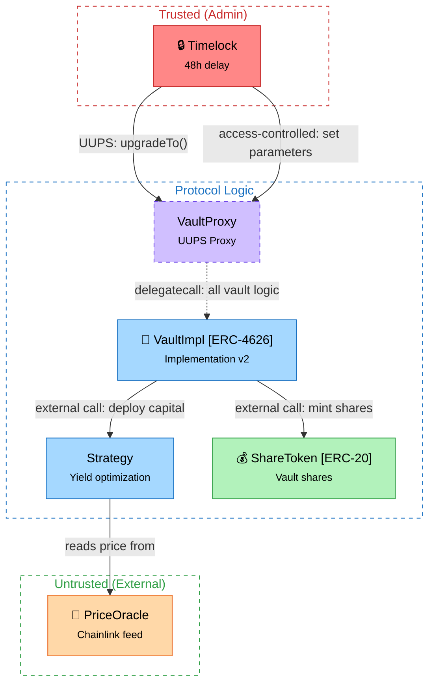

# Skill: Generate System Diagram

**Recommended model:** Sonnet

## Context Assembly

1. Run `npx hex context` to get the full codebase
2. Read `.hex/overview.md` if it exists
3. Read `.hex/patterns.json` for `UPGRADEABLE`, `CROSS_CHAIN`, `DELEGATECALL` flags and `protocol_hints`
4. Read `.hex/attack-surface.json` for entry point classification (permissionless/role-gated/owner-only), token interactions, and external dependencies
5. Read `.hex/access-control.json` for role structure and modifier usage

From these, identify:
- All concrete contracts (skip interfaces, abstract contracts, libraries)
- How contracts interact (calls, delegations, reads)
- Contract groupings / clusters by purpose
- Trust zone classification (admin-controlled, protocol logic, user-facing/external)
- Proxy relationships (which contracts are proxies, which are implementations)
- **Only include contracts that are in the audit scope** (defined in `.hex/config.json`). Out-of-scope contracts may appear as simplified nodes if they interact with in-scope contracts, but should not be the focus of any diagram zone. If there is no interaction with in-scope contracts, omit them entirely.

### Protocol-Type Detection

Read `.hex/patterns.json` and classify the protocol archetype:
- If `protocol_hints` includes "vault" or ERC4626 flag detected → **Vault** archetype
- If ORACLE flag + lending-related contract names → **Lending** archetype
- If `protocol_hints` includes "cross-chain" → **Bridge** archetype
- If governance-pattern contracts (Governor, Timelock, Voting) → **Governance** archetype
- If AMM/DEX patterns (constant product, swap, liquidity pool) → **AMM/DEX** archetype
- If staking/reward distribution patterns → **Staking** archetype
- Multiple archetypes may apply. Note all detected archetypes.

## Semantic Symbols

Prefix contract node labels with the matching symbol for instant visual scanning:

| Symbol | Meaning |
|--------|---------|
| 🏦 | Vault / ERC-4626 |
| 💰 | Token (ERC-20, ERC-721) |
| 🔮 | Oracle / price feed |
| 🔒 | Timelock / access control |
| 📦 | Storage / registry |
| ⚡ | Flash loan capable |
| 🌉 | Bridge / cross-chain |

Example: `vault["🏦 Vault [ERC-4626]<br/><small>Main entry point</small>"]:::core`

If a contract doesn't match any symbol, omit the prefix.

## Color Palette (classDef)

Define these styles at the bottom of every diagram:

```
classDef core fill:#a5d8ff,stroke:#1971c2,color:#000
classDef user fill:#b2f2bb,stroke:#2f9e44,color:#000
classDef admin fill:#ff8787,stroke:#c92a2a,color:#000
classDef ext fill:#ffd8a8,stroke:#e8590c,color:#000
classDef proxy fill:#d0bfff,stroke:#7048e8,color:#000,stroke-dasharray:5 5
classDef storage fill:#ffec99,stroke:#f08c00,color:#000
```

| Contract Type | Class | Color |
|--------------|-------|-------|
| Core logic (vaults, routers, main contracts) | `core` | Blue |
| User-facing entry points (depositors, swappers) | `user` | Green |
| Admin / privileged (governance, timelock, owner) | `admin` | Red |
| External dependencies (oracles, DEXes, bridges) | `ext` | Orange |
| Proxy / upgradeable contracts | `proxy` | Purple (dashed border) |
| Storage / registry | `storage` | Yellow |

## Node Format

Use HTML labels for two-line contract nodes:

```
id["🏦 ContractName<br/><small>One-line purpose</small>"]:::core
```

For contracts implementing a standard:
```
id["💰 ContractName [ERC-XXXX]<br/><small>One-line purpose</small>"]:::token
```

## Trust Boundary Zones

Use dashed-border Mermaid subgraphs to visually group contracts by trust level. Classify contracts into zones using `attack-surface.json` entry point categories and `access-control.json` roles:

```
subgraph trusted["Trusted (Admin-controlled)"]
  timelock["🔒 Timelock<br/><small>48h delay</small>"]:::admin
  governor["Governor<br/><small>Proposal execution</small>"]:::admin
end
style trusted fill:none,stroke:#c92a2a,stroke-dasharray:5 5,color:#c92a2a

subgraph protocol["Protocol Logic"]
  vault["🏦 Vault<br/><small>Core entry point</small>"]:::core
  strategy["Strategy<br/><small>Yield optimization</small>"]:::core
end
style protocol fill:none,stroke:#1971c2,stroke-dasharray:5 5,color:#1971c2

subgraph untrusted["Untrusted (User / External)"]
  oracle["🔮 PriceOracle<br/><small>Chainlink feed</small>"]:::ext
end
style untrusted fill:none,stroke:#2f9e44,stroke-dasharray:5 5,color:#2f9e44
```

**Zone classification guide:**
- **Trusted (Admin)**: Contracts only callable by privileged roles (owner, governor, timelock). These hold upgrade power, fee-setting ability, or pause authority.
- **Protocol Logic**: Core contracts that implement business logic. May have both permissionless and role-gated functions.
- **Untrusted (User/External)**: External dependencies (oracles, DEX routers) and user-facing entry points with no access control.

Use at least 2 of the 3 zones. If the protocol has no admin contracts, omit the Trusted zone.

## Proxy & Delegatecall Notation

When `UPGRADEABLE` or `DELEGATECALL` flags are detected in `patterns.json`:

**Proxy nodes** use the `:::proxy` class (dashed purple border):
```
proxy["VaultProxy<br/><small>UUPS Proxy</small>"]:::proxy
impl["🏦 VaultImpl<br/><small>Implementation v2</small>"]:::core
```

**Delegatecall arrows** use dashed lines (`-.->`) to visually distinguish from regular calls:
```
proxy -.->|"delegatecall: all vault logic"| impl
user -->|"calls"| proxy
```

**Label proxy arrows** with:
- Pattern type: UUPS, Transparent, Beacon, or Diamond
- Who controls upgrades: `admin["Admin EOA<br/><small>Controls upgrades</small>"]:::admin`

```
admin -->|"UUPS: upgradeTo()"| proxy
```

## Cross-Chain Notation

When `CROSS_CHAIN` flag is detected in `patterns.json`, use separate bordered subgraphs per chain:

```
subgraph ethereum["Ethereum L1"]
  l1Bridge["🌉 L1Bridge<br/><small>Lock tokens</small>"]:::core
end
style ethereum fill:none,stroke:#1971c2,stroke-width:2px,color:#1971c2

subgraph arbitrum["Arbitrum L2"]
  l2Bridge["🌉 L2Bridge<br/><small>Mint tokens</small>"]:::core
end
style arbitrum fill:none,stroke:#7048e8,stroke-width:2px,color:#7048e8

l1Bridge -->|"message via relayer/validator"| l2Bridge
```

Include bridge relayer/validator intermediary nodes where applicable.

## Layout Rules

- Use `graph TD` (top-down) — entry-point contracts at top, dependencies below
- Use `subgraph` blocks for trust boundary zones (see above)
- **Subgraph IDs must be space-free.** When a subgraph name has spaces, use `subgraph id["Display Name"]` so the ID works in `style` directives:
  ```
  subgraph core["Core Contracts"]
    vault["🏦 Vault<br/><small>Main entry point</small>"]:::core
    strategy["Strategy<br/><small>Yield logic</small>"]:::core
  end
  style core fill:none,stroke:#1971c2,stroke-dasharray:5 5,color:#1971c2
  ```
  Single-word names can be used directly: `subgraph Governance`
- 3 trust boundary zones max; keep it readable

## Node Limit

**Max ~15 contract nodes per diagram.** If the protocol has more contracts, split into 2-3 focused diagrams (e.g., `diagram-core.mmd`, `diagram-periphery.mmd`, `diagram-governance.mmd`). Each diagram should stand alone — include relevant cross-boundary contracts as simplified nodes.

## Edge Labels & Styles

- **Plain English only** — describe the interaction, not the function signature
- Every arrow must have a label
- **Edge style by interaction type:**
  - Solid arrow `-->` for regular external calls
  - Dashed arrow `-.->` for delegatecall
  - Dotted arrow `-.->` (thinner) for read-only / view calls
- **Include interaction type** where it matters for audit context:
  ```
  proxy -.->|"delegatecall: vault logic"| impl
  vault -->|"external call: mint shares"| token
  oracle -.->|"reads storage: latest price"| priceRegistry
  timelock -->|"access-controlled: set fees"| vault
  ```
- Keep labels short (2-6 words) — interaction type + plain description

## Slither Integration

If Slither is available in the project, cross-reference the Slither call graph for additional accuracy:
- Run `slither . --print call-graph` (if not already cached) and compare its contract-to-contract call edges against your manually identified edges
- Add any missing edges that Slither detects
- This is optional: if Slither is unavailable, proceed with manual analysis from codebase context

## File Structure

Every `.mmd` file must include:

1. **Overview comment** at the top — 1-2 sentences describing what the diagram shows:
   ```
   %% Architecture overview of the Vault protocol: core deposit/withdrawal
   %% contracts, token interactions, and governance controls.
   ```

2. **The diagram** — graph definition, nodes, edges, classDefs

3. **Visual legend** at the bottom (MANDATORY):
   ```
   %% --- Legend ---
   %% Trust zones: red-dashed=Admin  blue-dashed=Protocol  green-dashed=User/External
   %% Node colors: blue=Core  green=User-facing  red=Admin  orange=External  purple=Proxy  yellow=Storage
   %% Edge styles: solid(-->)=external call  dashed(-.->)=delegatecall  dotted=read-only
   %% Symbols: 🏦=Vault 💰=Token 🔮=Oracle 🔒=Governance 📦=Storage ⚡=Flash loan 🌉=Bridge
   ```

## Workflow

1. **Gather context** — run `npx hex context`, read `.hex/overview.md`, `patterns.json`, `attack-surface.json`, and `access-control.json`
2. **Plan** — list contracts, assign types/colors/symbols, classify into trust zones, identify proxy relationships. Sketch groupings in a code fence.
3. **Write the diagram** — produce the full Mermaid syntax and write it to `<output_dir>/diagrams/diagram.mmd` (create the `diagrams/` subdirectory if it doesn't exist)
4. **Validate** — read the file back and run through the validation checklist below
5. **Fix** — if any issue found, rewrite the file. Never leave a broken diagram.

## Validation Checklist

After writing, read the file back and verify ALL of the following:

- [ ] Opening/closing quotes are balanced (count them — must be even)
- [ ] Every node ID referenced in an edge (`A --> B`) is defined as a node
- [ ] No duplicate node IDs
- [ ] Every `subgraph` has a matching `end`
- [ ] Every `classDef` name used in `:::className` is actually defined
- [ ] All `style` targets use space-free IDs (use `subgraph id["Name"]` pattern for multi-word names)
- [ ] Overview comment block is present at the top
- [ ] Legend comment block is present at the bottom (MANDATORY)
- [ ] Node count is ≤15 (if over, split into multiple diagrams)
- [ ] Trust boundary zones present (at least 2 of 3: admin/protocol/untrusted)
- [ ] Legend includes trust zone colors, node colors, edge styles, and symbols
- [ ] If `UPGRADEABLE` flag detected: proxy nodes use `:::proxy` class and delegatecall uses dashed arrows (`-.->`)
- [ ] If `CROSS_CHAIN` flag detected: separate subgraphs per chain with distinct border colors

If any check fails, fix and rewrite — **never leave a broken diagram**.

## Example



## Guidelines

- **Plain English only** — arrow labels describe interactions, not function signatures
- **No interfaces / abstracts / libraries** — only show concrete, deployed contracts
- **Every arrow must have a label** explaining the relationship
- **Include interaction type on edges** when audit-relevant (delegatecall, external call, access-controlled)
- **Trust boundaries are required** — group contracts by trust level, not just by function
- **Proxy contracts get special treatment** — dashed purple border, dashed delegatecall arrows, labeled with pattern and upgrade controller
- **Keep it high-level** — show contract-to-contract relationships, not internal details
- **Max ~15 nodes** — split large protocols into multiple focused diagrams
- **Scope-aware** — only diagram contracts defined in the audit scope; out-of-scope contracts appear only when they interact with in-scope ones
- After writing, tell the user to check the Diagram tab in the dashboard (`hex dashboard`)
