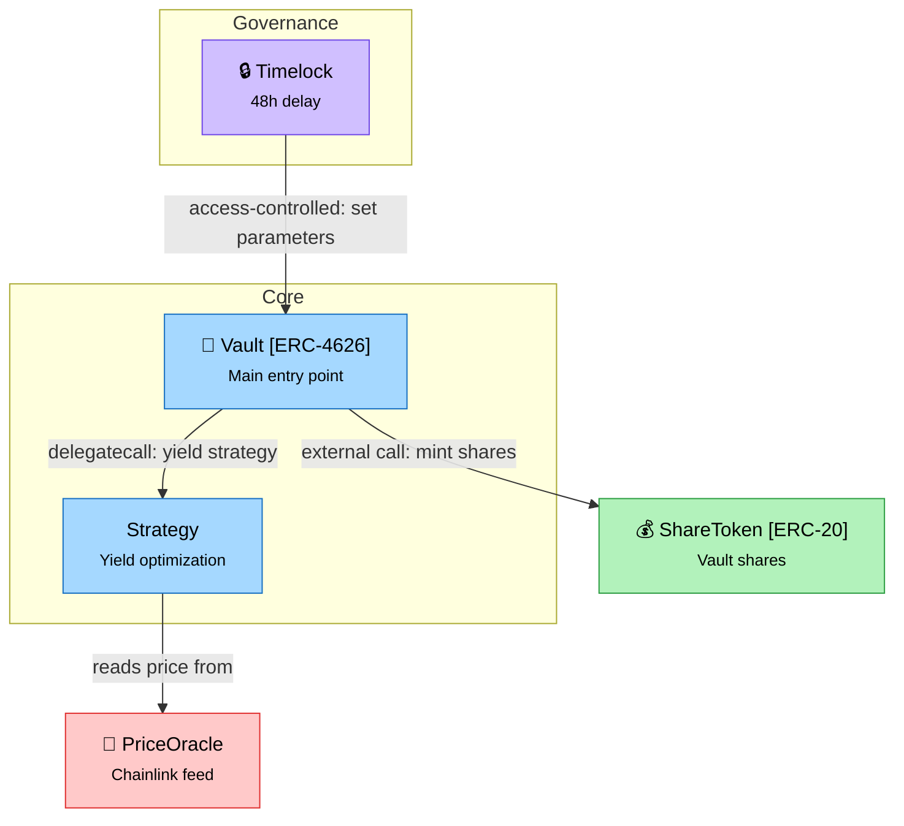

# Skill: Generate System Diagram

**Recommended model:** Sonnet

## Context Assembly

1. Run `npx hex context` to get the full codebase
2. Read `.hex/overview.md` if it exists

From these, identify:
- All concrete contracts (skip interfaces, abstract contracts, libraries)
- How contracts interact (calls, delegations, reads)
- Contract groupings / clusters by purpose
- **Only include contracts that are in the audit scope** (defined in `.hex/config.json`). Out-of-scope contracts may appear as simplified nodes if they interact with in-scope contracts, but should not be the focus of any diagram zone. If there is no interaction with in-scope contracts, omit them entirely.

## Semantic Symbols

Prefix contract node labels with the matching symbol for instant visual scanning:

| Symbol | Meaning |
|--------|---------|
| 🏦 | Vault / ERC-4626 |
| 💰 | Token (ERC-20, ERC-721) |
| 🔮 | Oracle / price feed |
| 🔒 | Timelock / access control |
| 📦 | Storage / registry |
| ⚡ | Flash loan capable |
| 🌉 | Bridge / cross-chain |

Example: `vault["🏦 Vault [ERC-4626]<br/><small>Main entry point</small>"]:::core`

If a contract doesn't match any symbol, omit the prefix — don't force it.

## Color Palette (classDef)

Define these styles at the bottom of every diagram:

```
classDef core fill:#a5d8ff,stroke:#1971c2,color:#000
classDef token fill:#b2f2bb,stroke:#2f9e44,color:#000
classDef oracle fill:#ffc9c9,stroke:#e03131,color:#000
classDef gov fill:#d0bfff,stroke:#7048e8,color:#000
classDef storage fill:#ffec99,stroke:#f08c00,color:#000
```

| Contract Type | Class |
|--------------|-------|
| Core (vaults, routers, main logic) | `core` |
| Token (ERC-20, ERC-721, shares) | `token` |
| Oracle / External integration | `oracle` |
| Governance / Admin | `gov` |
| Storage / Registry | `storage` |

## Node Format

Use HTML labels for two-line contract nodes:

```
id["🏦 ContractName<br/><small>One-line purpose</small>"]:::core
```

For contracts implementing a standard:
```
id["💰 ContractName [ERC-XXXX]<br/><small>One-line purpose</small>"]:::token
```

## Layout Rules

- Use `graph TD` (top-down) — entry-point contracts at top, dependencies below
- Use `subgraph` blocks for logical zones
- **Subgraph IDs must be space-free.** When a subgraph name has spaces, use `subgraph id["Display Name"]` so the ID works in `style` directives:
  ```
  subgraph core["Core Contracts"]
    vault["🏦 Vault<br/><small>Main entry point</small>"]:::core
    strategy["Strategy<br/><small>Yield logic</small>"]:::core
  end
  style core fill:none,stroke:#1971c2,stroke-dasharray:5 5,color:#1971c2
  ```
  Single-word names can be used directly: `subgraph Governance`
- 3 zones max; keep it readable

## Node Limit

**Max ~15 contract nodes per diagram.** If the protocol has more contracts, split into 2-3 focused diagrams (e.g., `diagram-core.mmd`, `diagram-periphery.mmd`, `diagram-governance.mmd`). Each diagram should stand alone — include relevant cross-boundary contracts as simplified nodes.

## Edge Labels

- **Plain English only** — describe the interaction, not the function signature
- Every arrow must have a label
- **Include interaction type** where it matters for audit context:
  ```
  vault -->|"delegatecall: yield strategy"| strategy
  vault -->|"external call: mint shares"| token
  oracle -->|"reads storage"| priceRegistry
  timelock -->|"access-controlled: set fees"| vault
  ```
- Keep labels short (2-6 words) — interaction type + plain description
- For simple relationships, plain English is fine: `vault -->|"delegates funds to"| strategy`

## File Structure

Every `.mmd` file must include:

1. **Overview comment** at the top — 1-2 sentences describing what the diagram shows:
   ```
   %% Architecture overview of the Vault protocol: core deposit/withdrawal
   %% contracts, token interactions, and governance controls.
   ```

2. **The diagram** — graph definition, nodes, edges, classDefs

3. **Visual legend** at the bottom — a comment block showing what colors and symbols mean:
   ```
   %% --- Legend ---
   %% Symbols: 🏦=Vault 💰=Token 🔮=Oracle 🔒=Governance 📦=Storage ⚡=Flash loan 🌉=Bridge
   %% Colors: blue=Core  green=Token  red=External/Oracle  purple=Governance  yellow=Storage
   ```

## Workflow

1. **Gather context** — run `npx hex context`, read `.hex/overview.md` and any analysis outputs
2. **Plan** — list contracts, assign types/colors/symbols, sketch groupings in a code fence
3. **Write the diagram** — produce the full Mermaid syntax and write it to `<output_dir>/diagrams/diagram.mmd` (create the `diagrams/` subdirectory if it doesn't exist)
4. **Validate** — read the file back and run through the validation checklist below
5. **Fix** — if any issue found, rewrite the file. Never leave a broken diagram.

## Validation Checklist

After writing, read the file back and verify ALL of the following:

- [ ] Opening/closing quotes are balanced (count them — must be even)
- [ ] Every node ID referenced in an edge (`A --> B`) is defined as a node
- [ ] No duplicate node IDs
- [ ] Every `subgraph` has a matching `end`
- [ ] Every `classDef` name used in `:::className` is actually defined
- [ ] All `style` targets use space-free IDs (use `subgraph id["Name"]` pattern for multi-word names)
- [ ] Overview comment block is present at the top
- [ ] Legend comment block is present at the bottom
- [ ] Node count is ≤15 (if over, split into multiple diagrams)

If any check fails, fix and rewrite — **never leave a broken diagram**.

## Example



## Guidelines

- **Plain English only** — arrow labels describe interactions, not function signatures
- **No interfaces / abstracts / libraries** — only show concrete, deployed contracts
- **Every arrow must have a label** explaining the relationship
- **Include interaction type on edges** when audit-relevant (delegatecall, external call, access-controlled)
- **Keep it high-level** — show contract-to-contract relationships, not internal details
- **Max ~15 nodes** — split large protocols into multiple focused diagrams
- **Scope-aware** — only diagram contracts defined in the audit scope; out-of-scope contracts appear only when they interact with in-scope ones
- After writing, tell the user to check the Diagram tab in the dashboard (`hex dashboard`)
