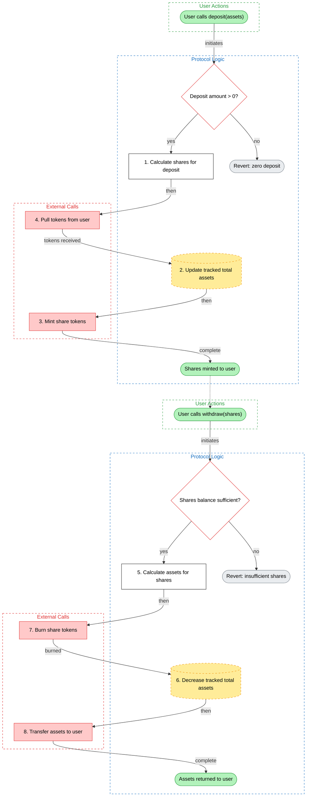

# Skill: Generate Flow Charts

**Recommended model:** Opus

## Context Assembly

1. Run `npx hex context` to get the full codebase
2. Read `.hex/overview.md` if it exists
3. Read `.hex/patterns.json` for `protocol_hints` and pattern flags
4. Read `.hex/attack-surface.json` for entry point classification (permissionless/role-gated/owner-only) and token interactions
5. Read `.hex/access-control.json` for role structure and modifier usage

**Only generate flows for in-scope contracts** (defined in `.hex/config.json`). Out-of-scope contracts may appear in subgraphs as external call targets when in-scope contracts interact with them, but do not generate standalone flows for out-of-scope contracts. If a contract has no relation to the audit scope, omit it entirely.

### Protocol-Type Detection

Read `.hex/patterns.json` and classify the protocol archetype:
- If `protocol_hints` includes "vault" or ERC4626 flag detected → **Vault** archetype
- If ORACLE flag + lending-related contract names → **Lending** archetype
- If `protocol_hints` includes "cross-chain" → **Bridge** archetype
- If governance-pattern contracts (Governor, Timelock, Voting) → **Governance** archetype
- If AMM/DEX patterns (constant product, swap, liquidity pool) → **AMM/DEX** archetype
- If staking/reward distribution patterns → **Staking** archetype
- Multiple archetypes may apply. Note all detected archetypes.

## Required Flow Types

Generate AT MINIMUM these flows for every protocol:

1. **Value Flow** — how tokens/ETH move through the protocol (deposits, withdrawals, fees, swaps)
2. **Permission Flow** — who can do what, how roles are granted/revoked, what admin operations exist

### Protocol-Specific Flows

Based on the detected archetype, generate these additional flows:

- **Vault**: deposit/mint flow, withdraw/redeem flow, strategy allocation flow, fee collection flow
- **Lending**: borrow flow, repay flow, liquidation flow (health check → liquidation → collateral seizure → bad debt handling)
- **Governance**: proposal lifecycle (create → vote → queue in timelock → execute), delegation flow
- **Bridge**: cross-chain message send flow (lock/burn → message relay → finality → mint/unlock), message receive/verification flow
- **AMM/DEX**: swap flow, add liquidity flow, remove liquidity flow, fee accrual flow
- **Staking**: stake flow, unstake/withdraw flow, reward claim flow, compounding flow

If the protocol has upgradeable contracts: generate an **upgrade lifecycle flow** (propose → timelock delay → execute upgrade → verify).

## Color Palette (classDef)

Define these styles at the bottom of every diagram:

```
classDef entry fill:#b2f2bb,stroke:#2f9e44,color:#000
classDef step fill:#ffffff,stroke:#1e1e1e,color:#000
classDef state fill:#ffec99,stroke:#f08c00,color:#000,stroke-dasharray:5 5
classDef ext fill:#ffc9c9,stroke:#e03131,color:#000
classDef decision fill:#ffffff,stroke:#e03131,color:#000
classDef reject fill:#e9ecef,stroke:#868e96,color:#000
classDef success fill:#b2f2bb,stroke:#2f9e44,color:#000
```

## Node Shapes

Use distinct Mermaid shapes for semantic meaning — makes diagrams instantly scannable:

| Element Type | Class | Node Syntax | Shape |
|-------------|-------|-------------|-------|
| Entry point (user action) | `entry` | `id(["Label"]):::entry` | Stadium (rounded) |
| Internal step | `step` | `id["Label"]:::step` | Rectangle |
| State change (storage mutation) | `state` | `id[("Label")]:::state` | Cylinder |
| External call | `ext` | `id["Label"]:::ext` | Rectangle |
| Decision / validation | `decision` | `id{"Label"}:::decision` | Rhombus |
| Rejection / revert | `reject` | `id(["Label"]):::reject` | Stadium (rounded) |
| Success outcome | `success` | `id(["Label"]):::success` | Stadium (rounded) |

Key rules:
- **Entry points, success outcomes, and revert/rejections** use stadium `([text])` — these are start/end nodes
- **State changes** use cylinder `[(text)]` — they represent storage mutations
- **Decisions** use rhombus `{text}` — branching points
- **Steps and external calls** use rectangle `[text]` — processing nodes

## Step Numbering

Number each step node sequentially for easy reference in findings and discussions:

```
s1["1. Validate deposit amount"]:::step
s2["2. Calculate shares using exchange rate"]:::step
s3["3. Pull tokens from user"]:::ext
s4[("4. Update total assets")]:::state
s5["5. Mint share tokens"]:::ext
```

Numbering makes flows easy to reference: "the vulnerability occurs between steps 3 and 4 in the deposit flow."

## Plain-English Labeling Rules

**All text must use plain English — never Solidity code.**

| What | Bad | Good |
|------|-----|------|
| Node label | `_deposit(assets, shares, receiver)` | `1. Calculate shares and mint to receiver` |
| State change | `totalAssets += amount` | `2. Increase tracked total assets` |
| Decision | `require(assets > 0)` | `Deposit amount > 0?` |
| External call | `IERC20(token).transferFrom(...)` | `3. Pull deposited tokens from user` |
| Edge label | `safeTransfer` | `"send tokens"` |

## Trust-Zone Swim Lanes

Use subgraphs to represent trust zones when a flow crosses trust boundaries. Map each step into the zone where it executes, using `attack-surface.json` classification:

```
subgraph userZone["User Actions"]
  start(["User calls deposit"]):::entry
end
style userZone fill:none,stroke:#2f9e44,stroke-dasharray:5 5,color:#2f9e44

subgraph protocolZone["Protocol Logic"]
  s1["1. Validate amount"]:::step
  s2{"Amount > 0?"}:::decision
  s3[("2. Update state")]:::state
end
style protocolZone fill:none,stroke:#1971c2,stroke-dasharray:5 5,color:#1971c2

subgraph externalZone["External Calls"]
  s4["3. Transfer tokens from user"]:::ext
end
style externalZone fill:none,stroke:#e03131,stroke-dasharray:5 5,color:#e03131

subgraph adminZone["Admin / Governance"]
  admin["Set fee parameter"]:::step
end
style adminZone fill:none,stroke:#c92a2a,stroke-dasharray:5 5,color:#c92a2a
```

Use trust-zone swim lanes when a flow involves at least 2 different trust zones (e.g., user action triggers external call, or admin action affects user-facing logic). For simple single-zone flows, regular contract-based subgraphs are fine.

## Layout

- **Always use `graph TD`** (top-down) — vertical layout fits desktop screens and handles branching naturally. Do not use `graph LR`.
- Use `subgraph` blocks as swim lanes per trust zone or per contract
- **Subgraph IDs must be space-free.** When a subgraph name has spaces, use `subgraph id["Display Name"]` so the ID works in `style` directives:
  ```
  subgraph depositPath["Deposit Path"]
    s1["1. Calculate shares"]:::step
    s2[("2. Update total assets")]:::state
  end
  style depositPath fill:none,stroke:#1971c2,stroke-dasharray:5 5,color:#1971c2
  ```
  Single-word names can be used directly: `subgraph Vault`
- **Connect all subgraphs.** When a flow has multiple independent sub-paths in separate subgraphs (e.g., deposit + withdraw), connect the end of each sub-path to the start of the next with a dotted edge. This forces Mermaid to stack them vertically instead of side-by-side:
  ```
  okDeposit -.-> startWithdraw
  ```
- Cross-contract calls are edges between subgraphs
- Every edge has a label: `s1 -->|"success"| s2`

## Node Limit

**Max ~15 steps per flow diagram.** If a flow is longer, split it into sub-flows (e.g., `flow-deposit-validation.mmd` and `flow-deposit-execution.mmd`). Each sub-flow should stand alone with its own entry and exit points.

## Error Path Rule

**Every decision diamond must show both the success path AND the revert/failure path.** Revert paths are critical for audit — they show what preconditions the protocol enforces.

Requirements:
- Decision diamonds MUST use red-bordered styling: `:::decision`
- Success path labeled with `"yes"` or the passing condition
- Revert/failure nodes MUST show the specific revert reason in plain English (e.g., "Revert: insufficient collateral" not just "Revert")
- For `require` statements: the condition check becomes the diamond, the revert path is labeled with the error name or revert string

```
d1{"Collateral ratio >= 150%?"}:::decision
d1 -->|"yes"| s3
d1 -->|"no"| fail1(["Revert: InsufficientCollateral"]):::reject
```

Never omit a revert branch from a decision.

## File Structure

Every `.mmd` file must include:

1. **Overview comment** at the top — 1-2 sentences describing what the flow covers:
   ```
   %% Flow: ERC-4626 deposit — user deposits underlying tokens,
   %% receives vault shares after validation and accounting update.
   ```

2. **The diagram** — graph definition, nodes, edges, classDefs, subgraph styles

3. **Visual legend** at the bottom — a comment block showing what colors and shapes mean:
   ```
   %% --- Legend ---
   %% Shapes: ([...])=Start/End  [...]= Step  [(...)]= State change  {...}=Decision
   %% Colors: green=Entry/Success  white=Step  yellow=State  red=External/Decision  gray=Revert
   %% Trust zones: green-dashed=User  blue-dashed=Protocol  red-dashed=External  dark-red-dashed=Admin
   ```

## Workflow

1. **Gather context** — run `npx hex context`, read `.hex/overview.md`, `patterns.json`, `attack-surface.json`, and `access-control.json`
2. **Plan all flows** — list each flow with its steps, contracts involved, trust zones, and decisions. Determine which protocol-specific flows to generate based on archetype. Output in a code fence.
3. **For each flow:**
   a. **Write the diagram** — produce full Mermaid syntax and write to `<output_dir>/diagrams/flow-<name>.mmd` (create the `diagrams/` subdirectory if it doesn't exist)
   b. **Validate** — read the file back and run through the validation checklist below
   c. **Fix** — if any issue found, rewrite the file. Never leave a broken diagram.
4. Generate flows sequentially — validate each before starting the next.

## Validation Checklist

After writing each flow, read the file back and verify ALL of the following:

- [ ] Opening/closing quotes are balanced (count them — must be even)
- [ ] Every node ID referenced in an edge (`A --> B`) is defined as a node
- [ ] No duplicate node IDs
- [ ] Every `subgraph` has a matching `end`
- [ ] Every `classDef` name used in `:::className` is actually defined
- [ ] All `style` targets use space-free IDs (use `subgraph id["Name"]` pattern for multi-word names)
- [ ] All subgraphs are connected — no disconnected subgraphs (use dotted edges `-.->` between independent sub-paths)
- [ ] Every decision node (`{...}:::decision`) has at least two outgoing edges (success + failure/revert)
- [ ] Entry points use stadium shape `([...])`
- [ ] Success/reject outcomes use stadium shape `([...])`
- [ ] State changes use cylinder shape `[(...)]`
- [ ] Overview comment block is present at the top
- [ ] Legend comment block is present at the bottom
- [ ] Node count is ≤15 (if over, split into sub-flows)
- [ ] Steps are numbered sequentially (1, 2, 3...)
- [ ] At least 2 flow types generated (value + permission at minimum)
- [ ] Trust-zone swim lanes used when flow crosses trust boundaries

If any check fails, fix and rewrite — **never leave a broken diagram**.

## Example



## Guidelines

- **Plain English only** — no function names, no Solidity syntax in any visible text
- **One file per flow** — `flow-deposit.mmd`, `flow-liquidation.mmd`, `flow-admin-pause.mmd`, etc.
- **Every arrow has a label** — "success", "revert", "if approved", etc.
- **Every decision shows both paths** — success AND revert/failure; revert paths are audit-critical
- **Decisions** use rhombus `{}` syntax with red stroke to draw attention
- **State changes** use cylinder `[()]` shape + yellow fill + dashed border to stand out
- **Entry/exit nodes** use stadium `([])` shape — makes flow boundaries clear
- **External calls** use red fill to highlight trust boundary crossings
- **Steps are numbered** — makes flows easy to reference in findings
- **Max ~15 nodes** — split long flows into sub-flows
- **Scope-aware** — only generate flows for in-scope contracts; out-of-scope contracts appear only as call targets of in-scope flows
- **Keep it concrete** — show the actual steps, not abstractions
- After writing all flows, tell the user to check the Flows tab in the dashboard (`hex dashboard`)
